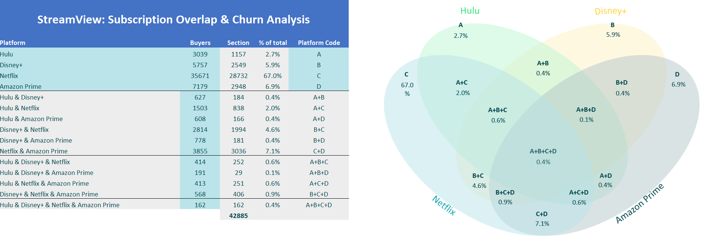

# 📊 StreamView: Subscription Overlap & Churn Analysis

## 📌 Overview
An Excel-based model analyzing how streaming subscriptions overlap across Hulu, Disney+, Netflix, and Amazon Prime. The goal is to identify cross-platform usage and churn patterns among subscribers.

---

## 🛠️ Tools Used
- Microsoft Excel
- Pivot Tables
- Conditional Formatting
- Venn Diagram (Illustrative)
- IF & Summary Formula Logic

---

## 📊 Key Features
- Platform-level subscription overlap distribution
- Classification of user types: single, dual, and multi-service subscribers
- Visual Venn diagram illustrating overlap combinations
- Percentage-based insights on subscriber relationships
- Clean and minimal layout for decision-making

---

## 📝 Insights
- **Netflix is the dominant platform**, with 67% of users subscribing only to it and serving as the top overlap platform across others.
- **Hulu has the highest overlap with Netflix (49.5%)**, while only 4.2% of Netflix users overlap back with Hulu — highlighting a possible churn risk for Hulu.
- **Disney+ overlaps significantly with Netflix (48.9%)** but retains more exclusivity than Hulu.
- **Amazon Prime has the strongest reciprocal overlap with Netflix (53.7%)**, suggesting bundled behavior or Prime loyalty.
- **Very few users (0.4%) subscribe to all four services**, indicating high competition for wallet share in multi-subscription scenarios.

---

## 🔗 View File  
[📂 Click here to open the Excel Model](https://github.com/prakshalishah/streamview-subscription-overlap/blob/main/StreamView_SubscriptionOverlap_Model.xlsx)

---

## 📷 Preview

